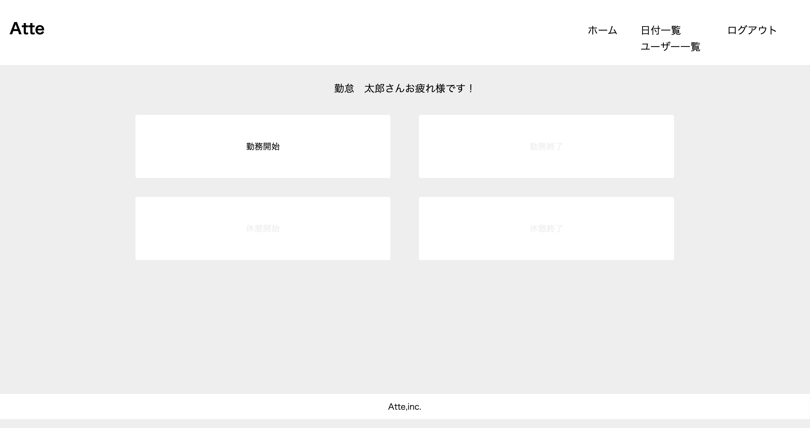

# 勤怠管理システム
出退勤や休憩の打刻を行ったり、日付別の勤怠表を参照できるアプリです。

## 作成目的
人事評価のため

## アプリケーションURL
- 開発環境：http://localhost/
   ※要ログイン
- phpMyAdmin：http://localhost:8080/

## 機能一覧
- 会員登録機能
- ログイン機能
- 勤務時間打刻機能
- 休憩時間打刻機能
- 日付別勤怠情報取得機能
- ページネーション機能
- メール認証機能
- ユーザー一覧取得機能
- ユーザー勤怠情報取得機能

## 使用技術(実行環境)
- PHP 7.4.9
- Laravel 8.83.8
- MySQL 10.3.39

## テーブル設計

## ER図

## 環境構築
Dockerビルド
1. git clone git@github.com:Ruchida123/attendance-app.git
2. docker-compose up -d --build

※MySQLは、OSによって起動しない場合があるのでそれぞれのPCに合わせてdocker-compose.ymlを編集してください。

Laravel環境構築
1. docker-compose exec php bash
2. composer install
3. .env.exampleファイルから.envを作成し、環境変数を変更
4. php artisan key:generate
5. php artisan migrate
6. php artisan db:seed

